# devlabs-sentiment-analysis
Analyzing audio files : Use Amazon Transcribe and Amazon Comprehend to analyze customer sentiment

# AWS services leveraged
Amazon Transcribe is an automatic speech recognition (ASR) service that makes it easy for developers to add speech-to-text capability to their applications. Using the Amazon Transcribe API, you can transcribe audio files stored in Amazon S3 into text transcripts.

Amazon Comprehend analyzes text and tells you what it finds, starting with the language, from Afrikaans to Yoruba, with 98 more in between. It can identify different types of entities (people, places, brands, products, and so forth), key phrases, sentiment (positive, negative, mixed, or neutral), and extract key phrases, all from text in English or Spanish. Finally, the Amazon Comprehend topic modeling service extracts topics from large sets of documents for analysis or topic-based grouping.

AWS Lambda lets you run code without provisioning or managing servers. You pay only for the compute time you consume – there is no charge when your code is not running.

AWS Step Functions makes it easy to coordinate the components of distributed applications and microservices using visual workflows.

Amazon Connect is a self-service, cloud-based contact center service that makes it easy for any business to deliver better customer service at lower cost. Amazon connect produces Call Recordings between caller and Agent interactions.


# Solution overview
The architecture is broadly divided into these components, as the following diagram illustrates:

Audio Transcript Storage → Amazon S3 bucket
Orchestration component and business logic component → AWS Step Functions and AWS Lambda
Transcribing component → Amazon Transcribe
Sentiment analysis component → Amazon Comprehend
Notification component → SNS Topic
Amazon Comprehend → Entity, sentiment, key phrases, and language output into an Amazon S3 bucket
AWS Glue maintains the database catalogue and database table structure. Amazon Athena queries data in Amazon S3 using the AWS Glue database catalogue.
Amazon QuickSight analyzes call recording and performs sentiment, and performs a key phrases analysis of caller-agent interactions.

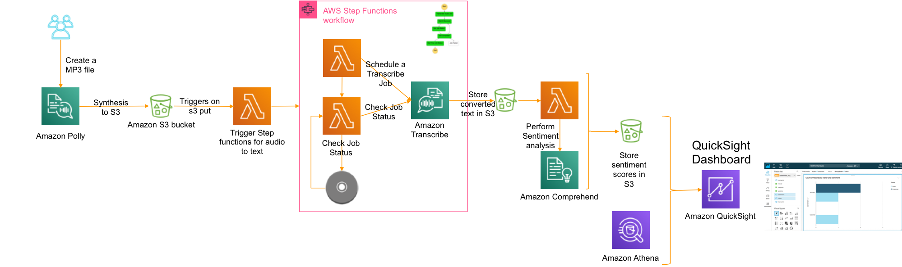

First, login to AWS Console [AWS Console](https://us-east-1.console.aws.amazon.com/) and Download on the [Cloudformation template link](https://github.com/deenadat/devlabs-sentiment-analysis/blob/master/template/sentiment-analysis.yaml) and click create stack in cloudforamtion template to launch the template in CloudFormation [Cloudformation Console link]( https://us-east-1.console.aws.amazon.com/cloudformation/home?region=us-east-1#/stacks/new?stackName=sentiment-analysis-call-recordings&templateURL=https://s3.amazonaws.com/devlab-2019/sentiment-analysis.yaml).
# Choose us-east-1 region

In the console, provide the following parameters:
•	RecordingsPrefix: S3 prefix where split recordings will be stored
•	TranscriptsPrefix: S3 prefix where transcribed text will be stored
•	TranscriptionJobCheckWaitTime: Time in seconds to wait between transcription wait checks
Leave all other default values. Select both “I acknowledge that AWS CloudFormation might create IAM resources” checkboxes, click on “Create Change Set”, and then choose Execute.

### Kindly note down the bucket name created in the cloudformation template.

# Step 1 : Choose Amazon Polly in AWS services list

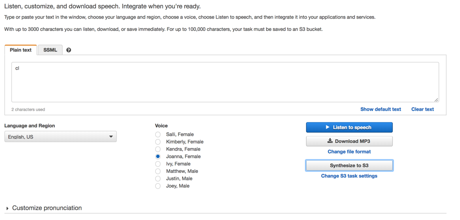


# Step 2 : Type in a text you want to analyse
For example : Hi! My name is Joanna. I will read any text you type here.

# Step 3: Click Synthesis to S3
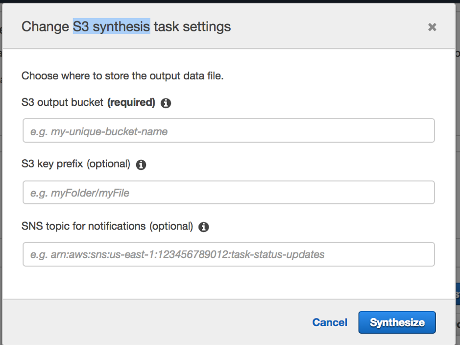
 


### S3 output bucket – xxxxx-connect  (Available in S3) (Kindly refer to bucket name in cloudformation template)
S3 key prefix – recordings/

#### Note: ensure slash is added at the back of prefix
 
 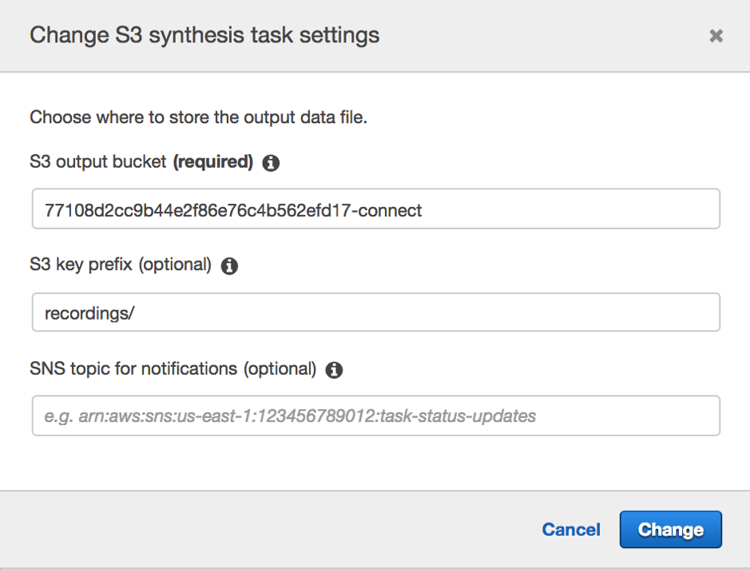

### Click synthesize

### Task will be created

 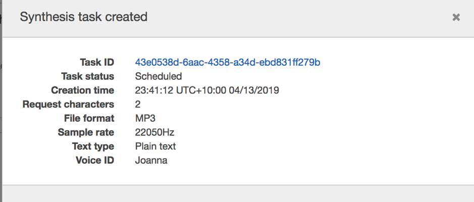


# Step 4: MP3 file will be created in the connect bucket

 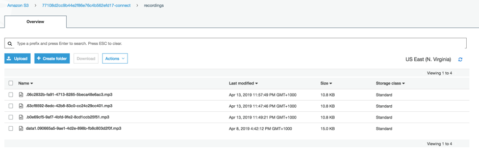

# Step 5: Choose transcribe and check the job status
 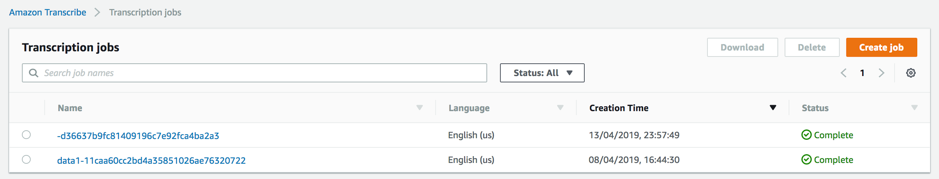

Once the job completes the MP3 is converted back into text and stored in same s3 bucket in the folder transcripts
 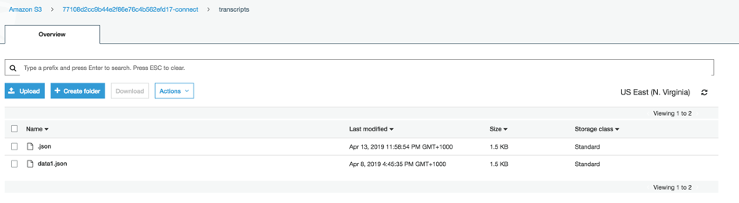

# Step 6: Comprehend would be triggered and sentiment analysis will be performed on the transcribed audio and stored in S3 comprehend folder

 
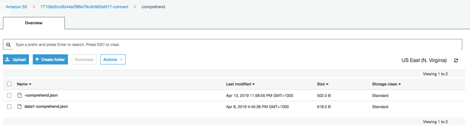


 
# Step 7: Visualize Analysis using Amazon QuickSight
We can visualize Amazon Comprehend’s sentiment analysis by using Amazon QuickSight. First, we must grant Amazon QuickSight access to Amazon Athena and the associated S3 buckets in the account. 

For more information on doing this, see Managing Amazon QuickSight Permissions https://docs.aws.amazon.com/quicksight/latest/user/managing-permissions.html.

We can then create a new data set in Amazon QuickSight based on the Athena table that was created during deployment.
After setting up permissions, we can create a new analysis in Amazon QuickSight by choosing New analysis.
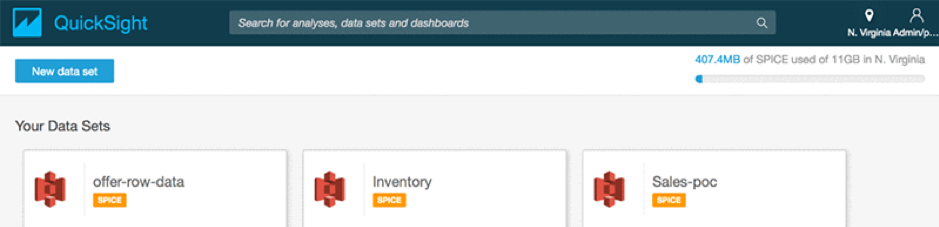 
Then we add a new data set.
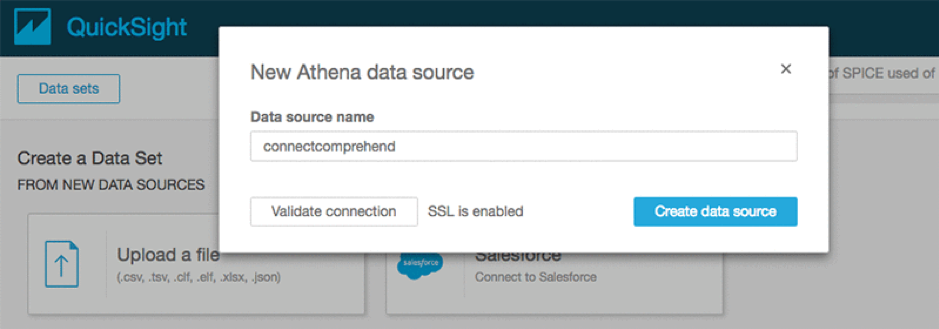

# Step 8: We choose Athena as the source and give the data source a name such as connectcomprehend.

Choose Athena as the source. For example: New Analysis -> Create Data Set

Choose the name of the database and the Use Customer SQL

### Kindly note down the database name

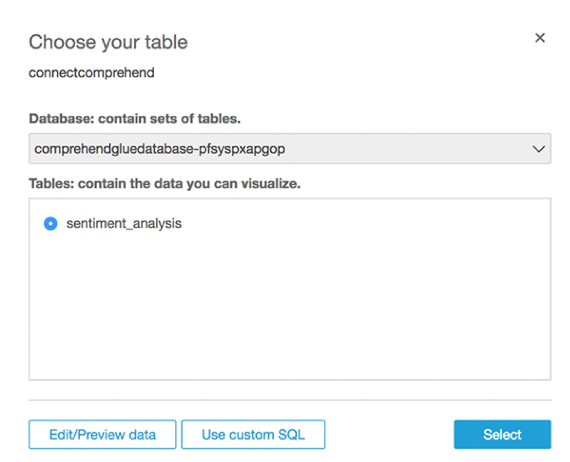
Give a Name to Custom SQL such as “Sentiment_SQL” and enter below SQL. Replace Database name <YOUR DATABASE NAME> with your one.

```
WITH sentiment AS (
  SELECT
    contactid
    ,talker
    ,text
    ,sentiment
  FROM
    "<YOUR DATABASE NAME>"."sentiment_analysis"
)

SELECT contactid,talker,transcript ,sentimentresult.sentiment ,sentimentresult.sentimentscore.positive ,sentimentresult.sentimentscore.negative ,sentimentresult.sentimentscore.mixed 
FROM sentiment  CROSS JOIN UNNEST(text) as t(transcript) CROSS JOIN UNNEST(sentiment) as t(sentimentresult)

```

Choose Confirm query.
 
# Step 9: Select Import to SPICE option and then choose Visualize

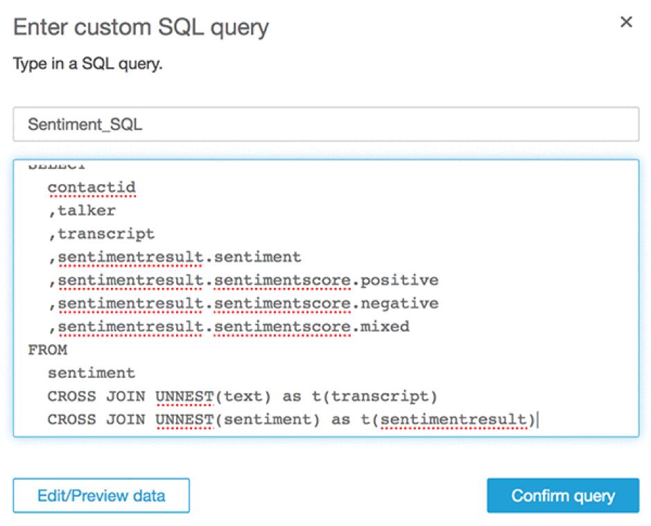
After that, we should see the following screen.
 
# Step 10: Now we can create some visualizations by adding Sentiment Analysis into visualization.
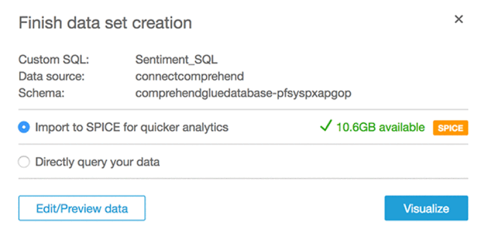

After that, we should see the following screen.

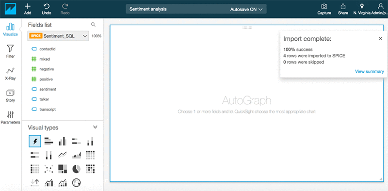

Now we can create some visualizations by adding Sentiment Analysis into visualization.

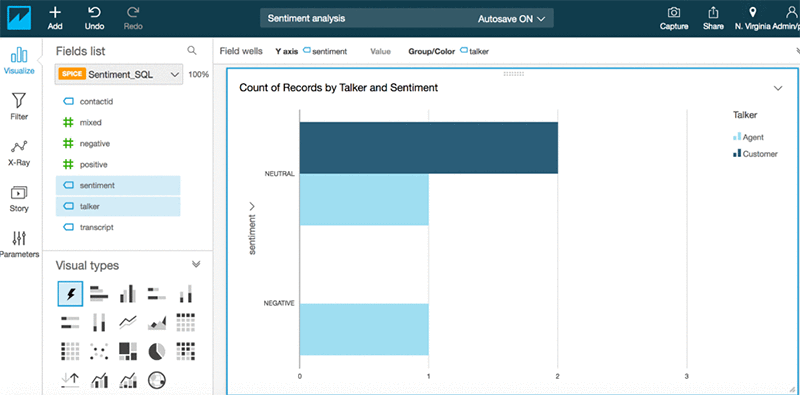

# Clean up the stack

Delete the cloudformation template created initially.

